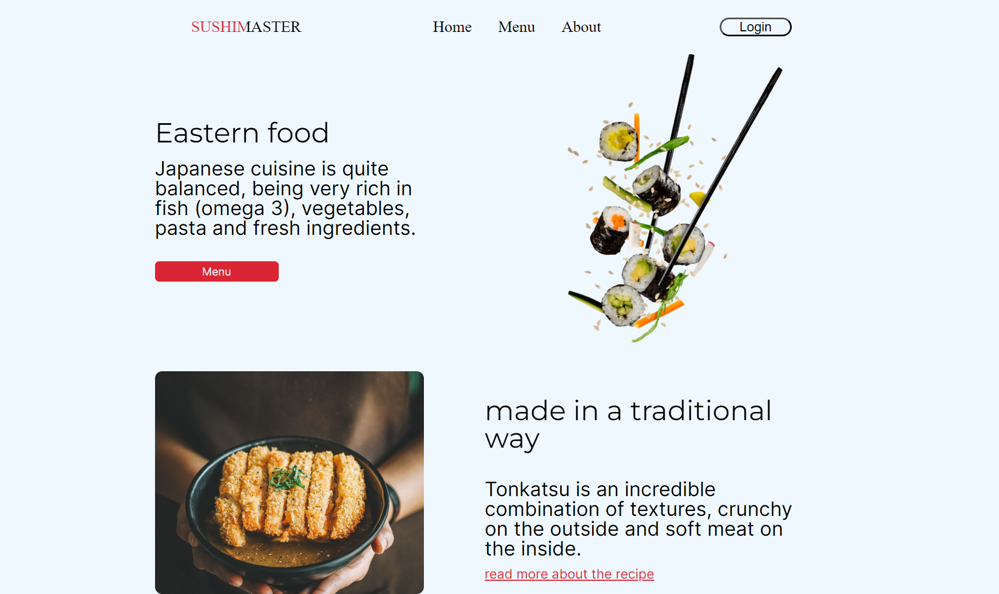
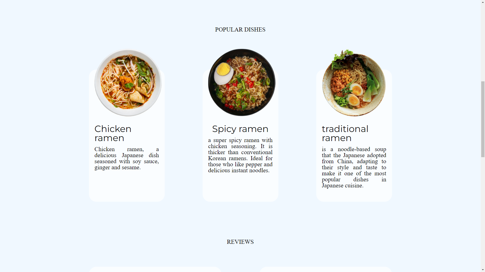

# Sushi Master
Este projeto é uma página web para o restaurante Sushi Master, que exibe o menu, informações sobre o restaurante, pratos populares, avaliações de clientes e localização para entrega. A interface é estilizada com CSS para proporcionar uma experiência visual agradável e intuitiva.

## Estrutura do Projeto
### HTML
O arquivo HTML contém a estrutura da página, incluindo o cabeçalho, seções principais, e o rodapé. As seções principais incluem:

- Header: Contém o menu de navegação com links para Home, Menu, About, e um botão de Login.
- Seções de Conteúdo: Divididas em várias subseções que apresentam informações sobre a culinária japonesa, pratos populares, avaliações de clientes e a localização para entrega.
- Footer: Contém informações de contato, sobre a empresa e serviços oferecidos.
### CSS
#### Dois arquivos CSS são utilizados para estilizar a página:

- reset.css: Usado para redefinir estilos padrões do navegador e garantir consistência entre diferentes navegadores.
- style.css: Contém todas as regras de estilo personalizadas para a página, incluindo layout, tipografia, cores, e espaçamento.
### Eastern Food
Esta seção apresenta uma descrição sobre a culinária japonesa e uma imagem de sushi flutuante.

</img>


### Prato Tradicional
Esta seção destaca os principais pratos servidos pela casa, os mais populares e deliciosos.

</img>


## Como Executar o Projeto

### Clone o Repositório:

```
git clone https://github.com/seu-usuario/sushi-master.git
```

- Abra o Arquivo index.html no Navegador:

Você pode abrir diretamente o arquivo index.html no seu navegador ou usar um servidor local para servir os arquivos.

## Conclusão
Este projeto serve como uma página de apresentação para o restaurante Sushi Master, proporcionando uma interface limpa e organizada para os visitantes obterem informações sobre o menu, lerem avaliações e localizarem o restaurante para entregas.

## Contribuição 

Este é um projeto de código aberto, então sinta-se à vontade para contribuir com sugestões, correções de bugs ou até mesmo novas funcionalidades. Todas as contribuições são bem-vindas!

## Licença 

Este projeto está licenciado sob a Licença MIT. Para mais detalhes, consulte o arquivo [LICENSE](LICENSE).

---
